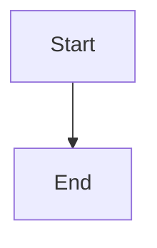
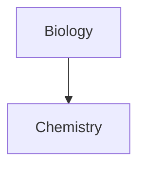

## Purpose

Produce Markdown files that render correctly in Obsidian, using Obsidian-specific syntax extensions beyond standard CommonMark and GFM. When a `.obsidian` directory is detected in the working directory or any ancestor, ask the user: "I noticed a `.obsidian` directory — would you like me to use Obsidian-flavored Markdown syntax?" before applying this skill.

Obsidian supports CommonMark, GitHub Flavored Markdown (GFM), and LaTeX as its base. All Obsidian-specific extensions are documented below with their exact syntax.

## Properties (Frontmatter)

Properties are stored in a YAML block delimited by `---` at the very top of the file.

```yaml
---
title: My Note
tags:
  - journal
  - project/alpha
aliases:
  - My Old Title
cssclasses:
  - wide-page
date: 2024-03-15
---
```

**Supported property types:**

| Type | Format | Example |
| --- | --- | --- |
| Text | Single line string | `title: A New Hope` |
| List | YAML list | `tags:\n  - one\n  - two` |
| Number | Integer or decimal | `year: 1977` |
| Checkbox | `true` or `false` | `draft: true` |
| Date | `YYYY-MM-DD` | `date: 2024-03-15` |
| Date & time | `YYYY-MM-DDTHH:MM:SS` | `time: 2024-03-15T10:30:00` |

**Default Obsidian properties:**

- `tags` — list of tag strings (no `#` prefix needed here)
- `aliases` — alternative names for the note
- `cssclasses` — list of CSS class names for per-note styling

**Obsidian Publish properties:** `publish`, `permalink`, `description`, `image`, `cover`

**Rules:**
- Internal links in property values must be quoted: `link: "[[Note Name]]"`
- Internal links in list properties must also be quoted: `- "[[Note Name]]"`
- Markdown formatting is not rendered inside properties
- Avoid deprecated forms: `tag`, `alias`, `cssclass` — use their plural equivalents

## Internal Links (Wikilinks)

```md
[[Note Name]]
[[Note Name|Display Text]]
[[Note Name#Heading]]
[[Note Name#Heading|Display Text]]
[[#Heading in this note]]
[[Note Name#^block-id]]
[[Note Name#^block-id|Display Text]]
```

**Searching across the vault:**

```md
[[##search term]]   link to any heading matching "search term"
[[^^search term]]   link to any block matching "search term"
```

**Markdown link format (interoperable alternative):**

```md
[Display Text](Note%20Name.md)
[Section](Note%20Name.md#Heading)
```

Blank spaces in Markdown-format links must be URL-encoded as `%20`. Prefer Wikilink format unless interoperability with non-Obsidian tools is required.

**Block identifiers** — append to the end of a paragraph with a blank space and `^`:

```md
This is the paragraph you want to reference. ^my-block-id
```

For structured blocks (lists, callouts, tables), the identifier goes on its own line with blank lines around it:

```md
- item one
- item two

^my-list-id
```

Block identifiers may only contain Latin letters, numbers, and hyphens.

## Embeds

Prefix any internal link with `!` to embed its content inline.

```md
![[Note Name]]
![[Note Name#Heading]]
![[Note Name#^block-id]]
```

**Images:**

```md
![[image.jpg]]
![[image.jpg|640x480]]   explicit width and height
![[image.jpg|100]]       width only, preserves aspect ratio
```

**External image with size control:**

```md


```

**PDFs:**

```md
![[Document.pdf]]
![[Document.pdf#page=3]]         open to page 3
![[Document.pdf#height=400]]     set viewer height in pixels
```

**Audio:** `![[recording.ogg]]`

**YouTube and Twitter/X** — use the standard external image syntax with the full URL:

```md


```

**Web pages via iframe:**

```html
<iframe src="https://example.com"></iframe>
```

Note: some sites block iframe embedding. Search for the site name + "embed iframe" if the default URL does not work.

## Callouts

```md
> [!type] Optional custom title
> Callout body content.
> Supports **Markdown**, [[wikilinks]], and ![[embeds]].
```

**Foldable callouts:**

```md
> [!tip]+ Expanded by default
> Body text here.

> [!warning]- Collapsed by default
> Body text here.
```

**Nested callouts:**

```md
> [!question] Can callouts be nested?
> > [!todo] Yes, they can.
> > > [!example] Multiple levels work too.
```

**Supported types and their aliases:**

| Type | Aliases |
| --- | --- |
| `note` | — |
| `abstract` | `summary`, `tldr` |
| `info` | — |
| `todo` | — |
| `tip` | `hint`, `important` |
| `success` | `check`, `done` |
| `question` | `help`, `faq` |
| `warning` | `caution`, `attention` |
| `failure` | `fail`, `missing` |
| `danger` | `error` |
| `bug` | — |
| `example` | — |
| `quote` | `cite` |

Type identifiers are case-insensitive. Any unsupported type defaults to the `note` style.

## Tags

**Inline tags** — use a `#` prefix directly in note body text:

```md
This note is about #productivity and #writing/fiction.
```

**Nested tags** — use `/` to create a hierarchy:

```md
#inbox/to-read
#project/alpha/design
```

**Valid characters:** letters, numbers, `_`, `-`, `/`, Unicode characters and emoji. Tags must contain at least one non-numeric character. No spaces allowed — use `#camelCase`, `#PascalCase`, `#snake_case`, or `#kebab-case`.

Tags are case-insensitive. When searching `tag:inbox`, Obsidian matches `#inbox` and all nested variants like `#inbox/to-read`.

In frontmatter, list tags without the `#` prefix:

```yaml
tags:
  - productivity
  - writing/fiction
```

## Obsidian-Specific Formatting

**Highlights:**

```md
==This text is highlighted.==
```

**Comments** (visible in editing view only, hidden in reading view and exports):

```md
This is an %%inline%% comment.

%%
This is a block comment.
It can span multiple lines.
%%
```

**Strikethrough:** `~~striked out~~`

**Task lists with custom statuses:**

```md
- [x] Completed
- [ ] Incomplete
- [?] Uncertain
- [-] Cancelled
```

**Footnotes:**

```md
Here is a reference[^1] and another[^note].

[^1]: The footnote text.
[^note]: Named footnotes render as numbers but are easier to manage.
```

Inline footnotes (reading view only):

```md
This sentence has an inline footnote.^[The footnote content goes here.]
```

**Escaping Markdown syntax** — prefix the character with `\`:

```md
\*not italic\*
\#not a heading
\|not a table separator
1\. not a list item
```

## Tables

Standard GFM table syntax with optional column alignment:

```md
| Left | Center | Right |
| :--- | :----: | ----: |
| A    |   B    |     C |
```

When using wikilinks or image resize syntax inside a table cell, escape the pipe with `\|`:

```md
| Column |
| --- |
| [[Note Name\|Display Text]] |
| ![[image.jpg\|200]] |
```

## Mermaid Diagrams

Wrap Mermaid syntax in a fenced code block tagged `mermaid`:

````md

````

To make diagram nodes into internal links, attach the `internal-link` class:

````md

````

Note: internal links from Mermaid diagrams do not appear in the Graph view.

## Math (LaTeX / MathJax)

**Block math:**

```md
$$
\begin{vmatrix}a & b\\
c & d
\end{vmatrix}=ad-bc
$$
```

**Inline math:**

```md
This is an inline expression $e^{2i\pi} = 1$.
```

## HTML Usage

Obsidian sanitizes HTML. `<script>` tags are stripped. Safe HTML elements include: `<u>`, `<s>`, `<span>`, `<div>`, `<iframe>`, `<table>`, `<br>`, `<hr>`, and HTML comments.

```html
<u>underlined text</u>
<s>strikethrough</s>
<span style="font-family: cursive">custom font</span>
<!-- This is an HTML comment, also visible as a hidden comment -->
```

**Critical limitations:**
- Markdown syntax inside HTML blocks is **not** rendered. `<div>**bold**</div>` will not produce bold text.
- HTML blocks must be self-contained. Blank lines within an HTML block break it.

```html
<!-- This works -->
<table>
<tr><td>Content</td></tr>
</table>

<!-- This does NOT work — blank lines break the block -->
<table>

<tr>

<td>Content</td>

</tr>

</table>
```

Use HTML for: underline, custom spans with CSS classes, iframes, and HTML comments as an alternative to `%%` comments when exporting via Pandoc.

## When to Use This Skill

- The user asks to write or format an Obsidian note
- The user mentions Obsidian, vault, or Obsidian-flavored Markdown
- A `.obsidian` directory is detected in the project tree — in this case, ask the user before applying
- Editing or generating `.md` files you know are destined for an Obsidian vault

## When NOT to Use This Skill

- Writing Markdown for GitHub READMEs, GitHub Pages, or any standard GFM renderer — wikilinks and callouts will not render correctly
- Writing for static site generators (Hugo, Jekyll, MkDocs, Docusaurus) unless the user confirms they have an Obsidian-compatible renderer plugin
- The user has specified they want plain CommonMark or a specific non-Obsidian Markdown flavor
- Documentation that must be portable across multiple tools
